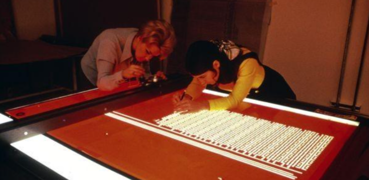
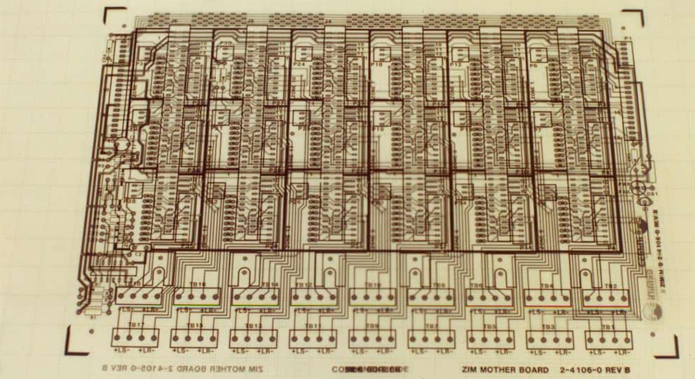
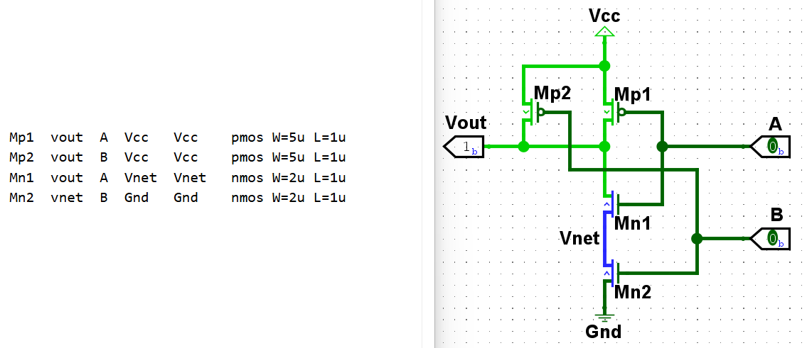

番外一 EDA发展史
====================================

我们已经学会使用 Logisim 画一些基础的电路了。虽然在 Logisim 上设计电路非常的麻烦，
但是对于初学的你来说非常的直观，我们学习了与或非门，直接用它们搭建电路。
现在怎么开始使用 Verilog HDL 语言了？与我们的电路之间有什么关系？

CAD (Computer Aided Design) 时代
~~~~~~~~~~~~~~~~~~~~~~~~~~~~~~~~~~~~~~~~~~~~~

1947年，世界上 `第一只晶体管 <https://ese.nju.edu.cn/_upload/article/files/ee/03/99413d344f88a45917a20e1d140b/99a67428-bb6a-4a64-9e0d-cfa2cf5ad898.pdf>`_ 在贝尔实验室诞生了，
体积不小，看起来也很像电子管。没过多久， **集成电路** (Integrated Circuit) 由 Jack Kilby 和 Robert Noyce 与1958年发明。
此后，各个半导体公司开始积极的采用集成电路技术来减少电路板制造的成本。其中集成电路的制造需要使用 **光刻掩膜板** (Mask Reticle) ，
使得晶圆上能够曝光出想要的电路形状。最早的掩膜板都是工程师手绘的，设计电路的方式看起来很朴素，基本所有工作都依赖人工。

图 Fig.1 工程师在在胶片上手工刻画设计图案，之后光学缩印制成光刻掩膜板

但是当晶体管的数量增多，手绘很容易出错，因此半导体公司开始使用 **计算机辅助设计** (CAD, Computer Aided Design) 来绘制掩膜板。
一开始有3个公司：Calma、Applicon、Computervision 专门负责开发 IC 掩膜板绘图工作站电脑销售给半导体公司。工作站电脑使用阴极射线管显示器以及电子绘笔 (类似于数控板) 进行绘制掩膜板。
Calma为 **IC 版图** (Layout) 开发了 **GDSII** (Graphic Design System) 数据格式，直到今天，几乎所有的 EDA 软件供应商与硬件系统都支持它。
它是一种二进制文件格式，以分层的形式 (二维 CAD 文件格式) 表示平面几何形状、文本标签以及其他有关的布局信息。

尽管拥有 CAD 来辅助绘制版图，但当时的电脑产业刚开始发展，如何更有效利用电脑来帮忙设计制造 IC 还在逐步地探索阶段。
Calma、Applicon、Computervision 三个公司除了集成电路版图绘制，还有机械、建筑等方向的绘图工作站开发，主要是深耕在制图方向。
而设计集成电路的工程师们发现他们不只是需要绘图的功能，还需要仿真、验证、自动布局布线等更多针对集成电路的软件功能。

CAE (Computer-Aided Engineering) 时代
~~~~~~~~~~~~~~~~~~~~~~~~~~~~~~~~~~~~~~~~~~~~~~~~~~

在贝尔实验室，Pat Pistilli 是最早从事设计自动化工作的人之一，开发了贝尔实验室自动化设计系统 BLADES 等，用于版图自动化等软件程序。
Pat 某次与朋友喝酒时，跟正在 IBM 工作的朋友 Joe Behar 交流到他的工作，Joe 觉得他设计的自动化设计系统可以帮助到其他半导体行业的人。
于是在1964年他们在大西洋城举办了一个叫做 **SHARE (Society to Help Avoid Redundant Effort，避免冗余工作协会)**  的研讨会，
邀请了各个半导体公司从事软件设计自动化的工程师们交流研究内容，举办后非常受欢迎。1967年他们决定把研讨会的名字改为
`DAC <https://dac.com/2026>`_ (Design Automation Conference，设计自动化会议) ，
也就是现在EDA软件界最重要的学术研讨会。

很多大学例如UC Berkeley、UCSD、UCI等，都开始研究专业的用于电子电路仿真软件的实验室。
于是这个时候的软件不再只是单纯的电路绘图软件，而是指电子电路以及集成电路的特性的工程仿真软件，用于集成电路以及PCB设计。
**Computer-Aided Engineering** 这个词开始出现，用来指代专门用于电子电路相关的CAD仿真软件。

图 Fig.2 1970年代人工设计绘制 PCB 

1970年代多层PCB开始迅速发展，但当时的PCB设计工作主要还是靠人工完成的。很多同学或许都在科研实践轮转中上手体验了简单的 PCB 设计，
一定能体会到人工设计绘制 PCB 的困难。

SPICE模拟器
-----------------------

在1973年 UC Berkeley 开发出了模拟电路仿真软件 **SPICE (Simulation Program with Integrated Circuit Emphasis)** ，
专门用于集成电路的仿真软件。一种用于电路描述和仿真的语言和仿真软件，有了SPICE，工程师们不再需要手算电路结果，
可以通过软件仿真，设计出更复杂的电路。同一时期的集成电路有Intel 4004，MOS 6502等微处理器，是拥有数千到数万个晶体管的庞大数字电路。
传统一个一个晶体管的绘制电路版图已经无比困难，也不具有任何经济效应。

图 Fig.2 spice语言描述的与非门（左），Logisim 绘制的与非门（右）

.. raw:: html

    

        
SPICE 描述电路

        
仔细观察左边spice代码片段，第一列是你给元器件的名称，第二到第五列分别是MOS管的漏极 (Drain)、栅极 (Gate)、源极 (Source)、衬底 (Bulk)。
        第六列是模型类型，最后两列是器件尺寸参数。我描述了4个MOS管所有端口的连接方式，与右边我使用 Logisim 绘制的电路图含义一致。
        你对比两种完全不同的电路描述方式后，更喜欢哪种方式呢？

    

新的数字IC设计方法
--------------------------

1979年，UC Berkeley的教授Carver Mead跟Xerox PARC的科学家Lynn Conway将他们设计OM、OM2微处理器的经验
出版了一本名为 `《Introduction to VLSI Systems》 <https://www.researchgate.net/publication/234388249_Introduction_to_VLSI_systems>`_ 的书，成为IC设计界内最经典的教科书，书中介绍了一种新的设计方法学。
随着VLSI以及微处理器等芯片的问世，模拟电路的工程师们不应该再从绘制晶体管版图开始。他们提出三个步骤：
首先，通过软件描述电路功能，并仿真验证，然后通过软件自动布局布线，最后拿布局完成的 Layout 给晶圆厂制造出集成电路，
这三步骤结构化的IC设计方法学，让那个年代的年轻工程师可以更轻易的设计超大规模集成电路芯片。

受到Mead和Conway的《Introduction to VLSI Systems》书的启发，1979年 VLSI Techonlogy 公司成立，1981年 LSI Logic 公司成立，
他们拥有晶圆厂和专门的 IC 设计软件，帮助需要定制芯片的电脑公司制造芯片。1980年成立的Daisy与Valid两个公司设计专注于电子电路的仿真的工作站电脑，
支持模拟电路仿真、数字电路波形仿真、简易自动生成版图等功能。这些公司与前面Calma、Applicon、Computervision主要开发绘图功能软件的公司显然不同。
但是Daisy和Valid公司开发的软件有个问题，就是他们的软件只能运行在他们开发的电脑硬件上面。在1980年代，Apollo、Hewlett-Packard以及Sun等
公司的通用工作站已经不仅能运行Office等一般的办公软件，也逐渐能够运行这些专业的CAE软件，Dasiy和Valid的产品逐渐没落。战略性地只开发CAE软件，
而不开发电脑硬件的Mentor Graphics跟Solomon Design Automation公司开始后来者居上。

Mentor Graphics 与 Cadence
---------------------------------------

**Mentor Graphics** 成立于1981年，专门负责开发数模混合设计仿真工具，自动布局布线工具，以及PCB设计验证工具，
当时的Mentor Graphics凭借专注的 CAE 软件，很快就称霸了市场，成为当时收入最高的 CAE 公司。

**Solomon Design Automation** (后面简称SDA) 是由原本在National Semiconductor 公司的模拟电路工程师 James Solomon 创办的，
SDA的软件产品一开始专注于模拟模拟集成电路的**电路图编辑器 (Schematic Capture)** ，Layout绘制，并尝试将SPICE等电路模拟器整合进入软件当中。
SDA在1987年并购了另一个专门做 **DRC (Design Rule Check)** 的公司 **ECAD** ，合并之后，两拨人马共同研发了新的电路模拟器Spectre，
一个类SPICE的电路模拟器，取代了学术版的SPICE，
并把这些功能整合进一个同时支持电路图编辑器、DRC (Design Rule Check) 检查、Spectre 模拟器以及 Layout 版图绘制的完整模拟电路设计软件 **Virtuoso** ，这个软件一经推出，很快称霸了模拟集成电路设计市场。
而这个由SDA和ECAD合并的公司，后来改名为 **Cadence** 。

此时的 CAE 软件就已经拥有用于模拟电路设计仿真、数字电路波形仿真、PCB 设计、版图绘制等功能了。比如你们使用的 Logisim 就是能够在画布上面设计电路，
并完成数字电路逻辑仿真。这些功能在上世纪 70~80 年代就能够帮助工程师设计出 ``MOS6502``、 ``intel 8086`` 等微处理器芯片了。

EDA (Electronic Design Automation) 时代
~~~~~~~~~~~~~~~~~~~~~~~~~~~~~~~~~~~~~~~~~~~~~

1980年代市面上已经诞生了很多用于模拟电路设计和数字电路波形仿真的软件，但工程师需要通过逻辑功能自己思考出对应的电路，
并完成电路图编辑，其过程类似于使用 Logisim 软件设计电路，然后通过波形仿真验证，最后进行布局布线，完成 Layout 版图设计。

VHDL 与 Verilog
----------------------------------

对于庞大而复杂的电路设计非常困难。那么能不能通过高级程序设计语言来描述数字电路功能，将描述电路的语言通过仿真器进行验证，
证明描述的电路功能符合设计，最后再思考出相对应的数字电路。

1983年，美国国防部基于这个想法开发了 **VHDL** 语言，1984年创业公司 Gateway 开发了 **Verilog** 语言，
我们把它们称之为 **硬件描述语言 HDL (Hardware Description Language)** 。
这两个 HDL 大幅简化了工程师前期验证电路功能正确性的工作量，他们可以使用 VHDL 和 Verilog 把电路功能描述出来，
确认功能正确以后，再去深入思考相对应的数字电路。因此硬件描述语言设计之初是作为验证电路功能正确性的语言，
工程师可以通过行为级建模高效地设计和验证电路功能。有没有办法通过软件自动化，能够直接把 HDL 转换为底层电路对应的 **Netlist 网表文件** 呢？
于是有工程师开始投入这个方向进行研究，他们把这个技术叫做 **逻辑综合 (Logic Synthesis)** 。

Synopsys
---------------------------

1986年，原本在美国通用电气工作的工程师 Aart de Geus 决定出来创业，专门研发逻辑综合这个技术。他与同事创建了Optimal Solutions公司，
并推出了支持 Verilog 逻辑综合的 Logic Compiler。而之后Optimal Solutions 改名为 **Synopsys** ，Logic Compiler也在2001年改名为 **Design Compiler** 。
在 Verilog 中，有一些语法是不能综合的，因为 Verilog 设计之初是用来验证电路功能正确性的语言，之后 Synopsys 才最先支持将 Verilog 能够自动化地转换成为底层电路的 Netlist，
所以并不是所有的 Verilog 语法都是可综合的，哪些语法能否综合需要取决于综合软件以及底层电路，但是所有语法都是可用于仿真验证。Synopsys 的逻辑综合软件的发明大幅简化了数字电路的设计流程，
原本已经在模拟电路设计软件领域称霸的 Cadence 如临大敌，于是在1989年收购了开发 Verilog 语言的 Gateway 公司，获得了其 Verilog 仿真器 **Verilog-XL** 。
随着逻辑综合软件的发明，数字集成电路复杂度得以上升，晶体管数量开始指数成长。

1980年代早期的自动布局布线技术会先固定好特定排列组合的晶体管，再根据电路的功能连线需要的门阵列，与可编程门阵列的原理比较像。
面对数十万，数百万门的超大规模自动化布局布线，也不只局限于传统的可编程门阵列的简易方式， **APR (Auto Placement & Route)** 软件开始研发。
不同于模拟集成电路设计和PCB设计的CAE时代，这个时期大家会使用更加专业的 **EDA (Electronic Design Automation)** 软件，使用电脑自动完成绝大部分工程工作。

