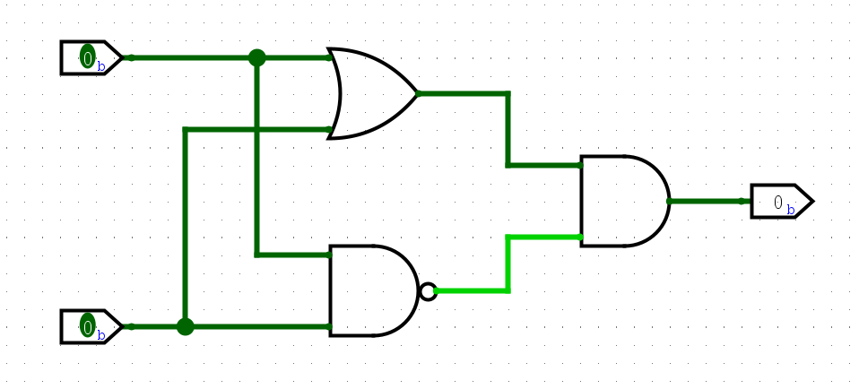

实验一 异或门
============================

异或门，英文为Exclusive-OR gate，简称XOR。当两个输入相同时，异或门的输出为0，反之为1。

下图是异或门符号和真值表，包括逻辑门的3种符号：形状特征型符号（ANSI/IEEE Std 91-1984）、IEC矩形国标符号（IEC 60617-12）和不再使用的DIN符号（DIN 40700）。

.. figure:: ../picture/lab1/XOR_truthtable.png
   :alt: 异或门符号和真值表
   :align: center

图 Fig.1 异或门符号和真值表

本次实验将使用Logisim仿真平台，通过与或非门电路相连实现，实现异或门等功能。最后在Logisim中自行设计搭建满足实验要求的电路，进行仿真测试，检查电路是否符合要求。

Logisim安装与教程
~~~~~~~~~~~~~~~~~~~~~

Logisim 是用于设计和仿真数字逻辑电路的图形化教学仿真工具。你可以摆放逻辑门电路或者电路模块，连接它们，来设计数字电路并仿真运行。本次实验我们将使用 Logisim 完成实验，后续实验课程将不使用它，但依然鼓励你使用它设计并搭建电路。它以一种直观的方式展现数字电路的设计与功能，方便你熟悉各种电路设计，为学习数字逻辑以及后续的实验课程奠定良好的基础。

搭建 Logisim 环境
-----------------------

Logisim 一个开源的 (GPL) ，基于 Java 虚拟机运行的软件，它可以运行在Windows、macOS、Linux上。

本实验推荐你在 `这里 <https://github.com/logisim-evolution/logisim-evolution/releases>`_ 下载 logisim-evolution ，它是 Logisim 的升级版，提供了更丰富的模块组件，并且集成了 Java 环境。
目前已经更新了 logisim-evolution 4.0.0 版本，打开链接有很多种后缀名的安装包： ``.msi`` 是 Windows 系统的安装文件， ``.dmg`` 是 macOS 系统的安装文件, ``.deb`` 是 debian 及其分支系统的安装文件， ``.rpm`` 是 Red Hat 及其分支系统的安装文件。
后缀名前面代表硬件架构， ``aarch64`` 代表64位 ARM 架构， ``amd64`` 和 ``x86_64`` 都代表64位 X86 架构。掌握了命名规则，请选择适合你电脑的安装包，如果确实没有符合你电脑的安装包，也可以下载源码进行编译安装。
本实验的内容不会对 Logisim 的版本有要求，你也可以自行选择安装的版本和方式。虽然只有实验一要求你使用 logisim 完成实验内容，但鼓励你多使用 Logisim ，可以加深你对基础电路的理解和印象。

熟悉 Logisim 界面
-----------------------

Logisim 界面总体可以分为5个部分：顶部的菜单栏、左上方的资源管理器、左下方的属性栏、画面正中的画布区，以及画布区上方的快捷工具栏。

顶部菜单栏可以对工程文件保存、加载，对操作进行撤回，在 ``Window`` 栏可以修改系统语言，查看快捷键等。在 ``Help`` 栏中还有教程，帮助你使用软件。

资源管理器用于设计和仿真，在设计栏中对不同的模块进行分类整理，本次实验课我们会使用到 ``Gates`` 门电路 以及 ``Input/Output`` 输入输出 ，对异或门进行设计和仿真。在仿真栏中可以开启或暂停仿真功能。

属性栏可以对画布中的或者即将添加的模块修改属性，比如输入位宽，端口朝向等。

画布可以进行缩放，在左下角的加减按钮可以对画布放大缩小， ``Ctrl + 鼠标滚轮`` 也可以缩放画布。

搭建异或门电路
~~~~~~~~~~~~~~~~~~~~~~~~~~~~~~~~~~~~~

.. raw:: html

   

     
若 Logisim UI 崩溃

     
如果你在使用 Logisim 的过程中遇到图形化界面崩溃，有严重的显示问题，影响使用该软件。
     在 <a class="reference external" href="https://blog.gitcode.com/ebfa6c46055d4d76975c7cf1912f29da.html">这里</a>
     提到这个问题的可能原因，Logisim 会在之后的版本中修复这个问题。不管使用哪个版本的 Logisim ，或者哪个版本的 Java ，
     都会导致图形化界面崩溃。我使用 Nvidia 30系显卡时遇到这个问题，如今更换显卡后问题消失了。
     4.0.0版本更新似乎并没有提到修复了该问题，如果你遇到这个问题可以在虚拟机中运行 Logisim ，可以避免这个问题。

   

根据图 Fig.1真值表，异或门在 A=0，B=1 或 A=1，B=0 时输出1，否则输出0。则 ``Y = AB' + A'B`` ，则对应的电路图如下

在选好模块后，鼠标悬停在画布上，使用 ``R`` 键可以旋转模块，点击鼠标左键即可摆放模块。可以直接在模块端口处拖动鼠标连线。按照上图搭建好异或门电路。

上面给出了一个由5个与或非门电路组成的异或门，下面给出了一个由3个与或非门电路组成的异或门。

.. raw:: html

   

      
德·摩根定律

      
通过德·摩根定律转换第二个电路图，使用3个与或非门组成异或门，与或非门包括与非、或非门。
      <strong>请将搭建完成的电路图截图保存，并放在实验报告中。</strong>

   

搭建好电路之后，还需要输入输出信号，才能控制你的电路，并输出结果。

在画布左上角有一排 ``快捷工具栏`` ，其中圈出的两个按钮是输入输出引脚，可以用于模块化的输入输出引脚，同时也可以改变输入引脚的值，用于仿真测试。

在 **Input/Output** 栏里面还有各种各样的输入输出模块。
**Button** 是一个按键，鼠标点击按下输出1，松手输出0。它没办法像家里面的灯的开关那样，保持状态输出1，因此需要鼠标控制多个输入时，它不是一个好的选择。但是在某些场景非常合适。
**Dip Switch** 是一个拨码开关，它可以在属性栏配置拨码开关的数量，并且可以保持输出的状态，你也可以使用它作为你的输入信号开关。

输出也可以选择 **LED** 小灯，输出1小灯亮起，输出0小灯熄灭。此外还有很多输入输出，比如七段数码管等，在之后的实验也会逐步接触。

``快捷工具栏`` 第一个 ``手指按钮`` 用于仿真操作，可以改变输入的值，操作电路；第二个 ``鼠标按钮`` 用于设计操作，可以编辑设计电路。

.. raw:: html

   

      
生活中的开关按键

      
按键的功能是正常输出0，当用户使用鼠标按下按键时，输出为1，松开鼠标后输出为0。拨码开关是往上拨动输出为1，往下拨动输出为0。
      你可以查阅并举一些实例，并说明生活中常见的开关与他们的功能相同吗？

   

搭建完成电路之后，点击左上角仿真栏，确保电路处于仿真状态，鼠标箭头用于编辑电路，使用手指可以改变电路的值。拨动拨码开关，观察LED灯结果，检查电路功能是否正常。

不同视角下的异或门
~~~~~~~~~~~~~~~~~~~~~~~~

接下来我们通过一些实例，了解异或门是如何在我们的电路中扮演各种角色的。

加法器 Adder
-------------

从真值表可以发现，异或门可以用于1位二进制数的加法运算，用于计算二进制加法的加和(Sum)位。
0+0=0，0+1=1，1+0=1，1+1=0。
在多位二进制数加法中还需要考虑进位(carry)位，
在之后的实验中便会使用异或门组成半加器和全加器，在此便不过多介绍了。

奇偶校验 Parity Check
-----------------------------------

对于2输入的异或门，当两个输入不一致时，或者说输入为奇数个1时，输出为1。对于多输入的与门、或门我们很容易理解，多输入与门依然是所有输入为1时，输出为1；而多输入或门只有全输入0，才输出0。
多输入与门和或门我们可以使用多个2输入的与门和或门组成，多输入异或门同理，可以由多个2输入的异或门组成。

.. raw:: html

   

     
模块化设计

     
在高级语言中，如果有一段代码会在很多地方使用，可以将这段代码变成一个函数，方便在各个地方调用它，这样可以缩减代码和程序的体积。
     在电路设计中，我们也可以把设计好的一块电路作为一个模块，方便我们在各个电路中<strong>实例化</strong>它，提高我们对电路的理解和掌控。

     
如果我在一个画布内绘制了10000个门电路，还容易理解、修改、测试电路吗？如果是10个电路模块呢，我们可以通过模块名字、注释信息等了解模块，
     方便我们理解其设计，修改电路，定位问题。就像是高级语言中，很少有一个函数写几千行代码的。

   

在 logisim 中，我们可以将电路封装成模块，方便我们在其他电路中像使用门电路那样直接 **实例化** 该模块，我们需要将电路的输入输出端口标明，
方便你实例化模块时将端口相连。将输入输出端口与电路相连，然后你就可以在别的电路中 **实例化** 该模块了。
假如该模块叫做 xor_circuit ，在添加输入输出端口后，可以在新的画布电路中，鼠标左键单击左侧资源管理器中的 xor_circuit ，即可摆放该模块。
你还可以自定义该模块的外观，在 ``资源管理器`` 右键点击电路模块，选择 ``Edit Circuit Appearance`` 编辑电路外观，可以自己绘制模块的形状，然后还需要在 ``属性栏`` 的外观中选择 ``自定义`` 。

然后在其他的电路画布中就可以像 ``资源管理器`` 中的其他电路一样摆放模块了。如下图所示，我自定义了一个 ``IEC 60617-12`` 标准的异或门符号。

.. figure:: ../picture/lab1/custom_appearance.png
   :alt: custom_appearance
   :align: center

.. raw:: html

   

      
使用2输入异或门搭建4输入异或门

      
4输入的与门功能与2输入的与门相同，当4个输入全为1时，输出为1，否则为0。按照搭建4输入与门的方法使用2输入的与门搭建4输入的异或门。
      <strong>请将搭建完成的电路图截图保存，并放在实验报告中。
      并回答多输入异或门的输出是否与输入1的个数是奇偶有关？为什么呢？</strong>

   

.. raw:: html

   

      
多输入异或门的搭建方法

      
尝试不同的搭建方式，最后的功能都是一样的吗？哪种搭建的方式更好呢？

   

既然多输入的异或门输出结果与输入1的个数是奇偶有关，因此可以应用于 **奇偶校验电路** 中。在一个通信系统中，若发送端每发送一组数据，
可以使用奇偶校验得知数据中1的个数是否为奇数，再加入额外的一位数，使得整体一定是奇数个1或者偶数个1。
在接收端使用奇偶校验，即可得知接收到的整体是否还是奇数个1或者偶数个1，这样便拥有一定的校验能力，能够在一定程度上判断接收数据的正确性。

数值比较 Comparator
-----------------------------------

对于2输入的异或门，当两个输入不一致时，则输出为1，因此这可以看作1位二进制数的比较。
如果两个多位二进制数要比较是否相等，则对应的每一位经过2输入异或门，相等的位对应的异或门输出为0，如果每个2输入异或门都输出为0，则这两个多位二进制数相等。

.. raw:: html

   

      
8位二进制数比较器

      
搭建一个8位二进制数比较器，如果两个数相等，则结果输出0，不相同则输出1。使用电路对多个2输入异或门的输出进行判断，如果所有异或门输出都为0，那么说明两个数相等，结果应该输出为0。
      <strong>请将搭建完成的电路图截图保存，并放在实验报告中。</strong>

   

取反操作 Inverter
-----------------------------------

观察2输入的异或门的真值表，我们可以认为，当输入A为0时，输出与B一致，当A为1时，输出等于B取反。因此我们可以使用一个信号来控制一个二进制数是否取反。

.. raw:: html

   

      
控制8位二进制数取反操作

      
搭建一个8位二进制数取反控制电路。有一个控制信号，如果控制信号为1，则对8位二进制数进行取反操作，如果控制信号为0，则不进行取反操作。
      控制信号输入每一个2输入异或门，即可控制每一位输入二进制数的取反操作。
      <strong>请将搭建完成的电路图截图保存，并放在实验报告中。</strong>

   

按位取反也是很常见的操作，通常用于数值的处理，或者位操作。之后的实验会讲到减法操作是如何转换为加法操作。

.. raw:: html

   

      
再次提醒

      
不要忘记橙色的提示框内容是实验必做内容！需要写到实验报告中提交的内容！
      实验报告模板在<a class="reference external" href="https://gitee.com/cocoa_gitee/course_-fcma201_25-fall">Course_FCMA201_25Fall</a>中，
      如果你的本地仓库中没有实验报告模板，请使用 git pull 更新本地仓库。

   

logisim 可以保存工程文件到指定目录，这样搭建好的电路就可以重复使用了。
同时搭建好的电路可以封装成为模块连接使用，在顶部菜单栏的 ``help`` 栏中有详细的教程 ``Tutorial`` 想要了解软件功能或者某个电路模块的功能可以 **RTFM** 。