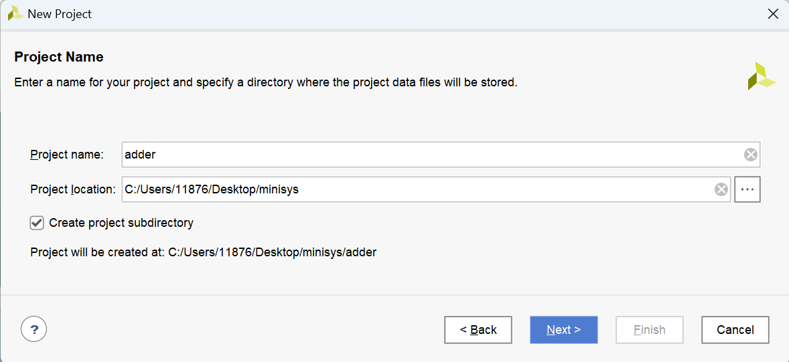

实验二 加法器设计与仿真
==========================================

Verilog 是一种用于描述、设计电路的 **硬件描述语言 HDL (Hardware Description Language)** ，
在实验一，我们已经尝试在 logisim 中设计并绘制电路图，并通过输入输出测试电路的功能。
本次实验我们使用 Verilog 的各种基础语法完成一些电路设计，并通过仿真代码和波形图测试电路的功能。

为此，我们需要使用 Verilog 仿真器，常见的仿真器有很多：VCS 、modelsim 、Verilog-XL 、iverilog 、verilator 等。
考虑到后续实验我们将使用 Xilinx 的 FPGA 教学实验板，为此我们直接使用 Vivado 的 xsim 仿真器，能够在一体式软件中完成整个实验的流程。

本次实验课我们使用 Verilog HDL 设计加法器等一些简单的电路，并编写 Testbench 程序，
使用 Vivado 的仿真器测试我们设计的电路。

Verilog 代码编写环境
~~~~~~~~~~~~~~~~~~~~~~~~~~~~~~~~

工欲善其事，必先利其器。
一个好的代码 Coding 环境能极大的帮助你编写代码。

VS Code + Verilog-HDL/SystemVerilog/Bluespec SystemVerilog + ctags 插件
-----------------------------------------------------------------------------

Vivado 作为一个集成开发环境，拥有代码编辑能力。不过作为一个大型软件，响应速度相对较慢，
编写代码也没有插件那么方便。因此我们平时都是使用编辑器编写代码，当然有很多好用的编辑器，
这里介绍 ``VS Code`` + ``Verilog-HDL/SystemVerilog/Bluespec SystemVerilog`` + ``ctags`` 插件。

安装好 ``Verilog-HDL/SystemVerilog/Bluespec SystemVerilog`` 和 ``ctags`` 插件后，可以为 Verilog 等
语言提供基础的高亮和语法框架支持，还可以提供 ``动态语法检查`` 、鼠标悬停查看信号定义、跳转信号和模块等功能。相信对经常写代码的你们
来说，这些功能不会陌生。你们可以在 `这里 <https://dphweb.cn/index.php/2023/08/22/verilog-hdl%e6%8f%92%e4%bb%b6%e9%85%8d%e7%bd%ae%e6%95%99%e7%a8%8b/>`_ 学习
配置教程，并不复杂。

Full Adder 全加器
------------------------------------------------------

我们给出一种 Full Adder 全加器的 Verilog 实现方式参考：

.. code-block:: v
   :caption: Full Adder 全加器的 Verilog 实现方式参考
   :emphasize-lines: 12
   :linenos:

   module ref_fa (
       a       // <<i<<
      ,b       // <<i<<
      ,cin     // <<i<<
      ,sum     // >>o>>
      ,cout    // >>o>>
   );
      input a, b, cin;
      output sum, cout;
      wire a, b, cin;
      wire sum, cout;
      assign {cout, sum} = a + b + cin;
   endmodule

.. raw:: html

   

      
加法器的代码实现

      
加法器的 RTL 实现方式有很多，行波进位加法器、选择进位加法器、超前进位加法器、进位旁路加法器等。
      当然还有上面参考代码的朴实无华的 + 号运算符实现的加法器，你觉得哪种代码编写的实现更好呢，这个问题开放答案，欢迎留下你的想法。

   

第一个 Testbench 程序
----------------------------------------

Verilog 代码设计完成后，还需要进行重要的步骤，即逻辑功能仿真，仿真激励文件称之为 testbench，
就像你之前使用 Logisim 设计完电路之后，需要你输入信号，观察输出，检查你的电路设计功能是否符合你的要求。

我们从一个全加器的简单 Testbench 入手，编写你自己的第一个 Testbench 程序。

.. code-block:: v
   :caption: 一个全加器的简单 Testbench
   :emphasize-lines: 1, 6-12, 21
   :linenos:

   `timescale 1ns/1ps
   module ref_tb ();
      reg [2:0] in;
      wire sum, cout;

      ref_fa u_ref_fa (
          .a       (in[0]) // <<i<<
         ,.b       (in[1]) // <<i<<
         ,.cin     (in[2]) // <<i<<
         ,.sum     (sum)   // >>o>>
         ,.cout    (cout)  // >>o>>
      );

      initial  begin
         in = 3'b0;
         #100;
         for (integer i = 0; i < 8; i = i + 1)  begin
            in = in + 1;
            #100;
         end
         $stop;
      end

   endmodule

相信你理解这个程序并不会感到困难，在 Logisim 中，你可以把一个画布中的电路引出输入输出口，封装成模块，然后在另一个画布中放置这个模块。
其中高亮的一大段，代表对 ``ref_fa`` 进行实例化，即在另一个模块中使用这个模块，然后将这个模块的信号与
对应的信号相连。 ``.a`` 代表 ref_fa 中的 a 端口，后面括号中的 in[0] 是 ref_tb 中的信号，这样就完成了相连的操作。

Testbench 中一定会使用到 \`timescale [timeunit]/[timeprecision] 。用来表示仿真时间的基本单位和时间精度。
``#100`` 也就是延迟 100个时间单位之后，再接着执行后面的语句。而时间精度代表最小的仿真尺度，对于 \`timescale 1ns/1ps 你写 ``#1.1111`` ，
则延迟 1.1111 ns，但由于 0.0001 是 0.1 ps，时间精度没这么高，因此会四舍五入变成延迟 1.111 ns。

$stop 系统任务则是将仿真暂停，有点像是 Debug 打断点，你运行就会发现箭头指向 $stop ，仿真停下来了，可以手动继续运行仿真。

然后我们对 in[2:0] 信号进行驱动，也就是对它进行赋值操作，我们直接使用 for 循环进行遍历所有的输入情况，然后你可以对比
所有的输入是否会得到正确的输出，即可完成 Testbench 仿真测试。

Vivado 使用教程
~~~~~~~~~~~~~~~~~~~~~~~~~~~~~~~~~~~

Vivado 是 Xilinx 公司的 FPGA 集成设计环境，本次实验我们将使用 Vivado 对 Verilog 设计进行仿真。
我们推荐使用 Vivado 2018.3 ，安装 WebPACK 版本。
该版本安装体积约 20 GB，而近几年的版本安装体积已经约 100 GB，WebPACK 是免费的，不需要许可证的版本，并且已经能够满足我们的实验需求。
如果你此前已经安装 2015 年之后的版本，都是能够满足完成实验的。Vivado 不同的版本之间功能差异也比较小，在学习和使用上也不会造成困难。

创建 adder 工程
-------------------------------

打开 Vivado 软件，会来到 Vivado 软件初始界面

.. figure:: ../picture/lab2/vivado_home.png
   :alt: vivado_home
   :align: center

Vivado 软件很复杂，我们一点点来了解它。创建一个名为 adder 的新项目，并保存在合适的位置， **一定要是全英文的目录** 。
勾选 ``Create project subdirectory`` 则会在保存新项目的地方创建一个项目名称的文件夹，用于存放项目的文件。
你也可以手动创建一个项目名称的文件夹，作为保存项目的位置，就不勾选该选项了。

来到器件选择页面， ``Family`` 系列选择 ``Artix-7`` ， ``Package`` 封装方式选择 ``fgg484`` ，
然后选择 ``xc7a100tfgg484`` ，完成器件选择，其余的步骤直接下一步即可。

.. figure:: ../picture/lab2/vivado_device.png
   :alt: vivado_device
   :align: center

完成创建项目，来到该项目初始页面，本次实验内容我们只需要关心红色方框标记出来的区域。
左侧是 ``Flow Navigator`` 流程导航，我们完整的实验整个流程就是依次从上往下进行的。
左上角是 ``项目管理`` ，目前由于正处于项目管理界面，因此 ``PROJECT MANAGER`` 是蓝色的。

.. figure:: ../picture/lab2/vivado_prj.png
   :alt: vivado_prj
   :align: center

完成了加法器和 Testbench 程序的编写，我们就可以进行仿真验证了。

首先需要将编写好的源代码添加到工程中，我们可以通过这两个地方添加源文件。

.. figure:: ../picture/lab2/add_source.png
   :alt: add_source
   :align: center

有三种类型的源文件，如下图所示，有 ``design source`` 设计文件、 ``simulation source`` 仿真文件和 ``constraints`` 约束文件。
设计文件就是我们描述的电路，仿真文件就是 Testbench，约束文件下一次课才会使用。

.. figure:: ../picture/lab2/source_type.png
   :alt: source_type
   :align: center

依次添加设计文件和约束文件，添加完成之后，会自动更新源代码的结构，如下图所示。

.. figure:: ../picture/lab2/source_struct.png
   :alt: source_struct
   :align: center

源文件自动更新了顶层文件，如果你想修改顶层文件，可以对源文件右键 ``Set as Top`` 修改为顶层文件。点击行为仿真，即可进行仿真操作。

.. figure:: ../picture/lab2/behavioral_simulation.png
   :alt: behavioral_simulation
   :align: center

打开仿真界面后，我们可以看到仿真产生的信号波形，如下图所示。

序号1的播放键按钮用于运行仿真，序号2的按钮用于重启仿真。

序号3的方框可以选择模块，序号4的方框可以添加模块中的信号显示波形。

序号5的方框用以显示信号波形，序号6的两个放大镜按钮可以放大和缩小波形显示范围，序号7的按钮将显示完整的仿真波形信号。

.. figure:: ../picture/lab2/vcd.png
   :alt: vcd
   :align: center

观察波形，每个输入信号是否都对应着正确的输出信号。

Carry-look-ahead 超前进位加法器
~~~~~~~~~~~~~~~~~~~~~~~~~~~~~~

超前进位加法器是一种进位链延迟更短的加法器，我们已经在理论课上学习了4位超前进位加法器的原理。

4位超前进位加法器
------------------------

.. raw:: html

   

      
4位超前进位加法器的实现

      
按照逻辑公式或者电路，完成4位超前进位加法器的代码实现。
      下面给出了代码框架，在代码框架的基础上完成代码的编写。

   

.. code-block:: v
   :caption: 4位超前进位加法器代码框架
   :emphasize-lines: 9-11
   :linenos:

   module cla_4bit(a, b, cin, sum, cout);

      input a, b, cin;
      output sum, cout;

      wire [3:0] a, b, sum;
      wire cin, cout;

      // Your codes should start from here.

      // End of your codes.

   endmodule

全加器你写好了，你很自信，这真的还需要测试吗？4位超前进位加法器你也写好了，这个也不难，只需要非常的细心。
那这个需要写 Testbench 测试吗，你现在有信心认为代码一定是正确的吗？

那该怎么写呢，还是和参考的 Testbench 一样吗，不过这次的信号数量特别多，真值表一共有512列，我需要依次去看
512次的波形，然后检查是否符合预期吗，这看起来很蠢 : (

.. raw:: html

   

      
一种 Testbench 测试思路

      
我们能否改造一下 ref_fa ，其使用 + 号运算符，看起来会得到正确的结果。那我们能否同时测试我们写的4位超前进位加法器模块
      和改造好的4位 ref_fa 模块，每次对比一下输出的值是否相同。如果结果不相同则说明4位超前进位加法器模块有问题，
      我们把参考机称为 ref (Reference) ，而我们的待测电路称为 dut (Device Under Test) ，原理如下图所示。
      可以打印一句提示信息，这样就不用我们去一个个看波形了。打印信息可以使用 $display() 函数，使用方法很像 printf 函数，具体可以 STFW。

   

.. raw:: html

   

      
测试4位超前进位加法器

      
你编写的这个4位超前进位加法器后续会用于组成更大位宽的加法器，
      以及之后的实验中，请你好好测试你的代码，不要留下Bug。
      编写一个 Testbench 用于测试你的4位超前进位加法器，
      命名规则最好类似于 tb_cla_4bit ，这样很清晰的能够看得出这是用于测试什么模块的激励文件。

   

层次化超前进位加法器
------------------------

理论课上已经讲过层次化超前进位加法器，这样可以显著提升加法器的性能，但是随着加法器位宽的提升，进位的计算会花费指数级增加的电路开销。
因此对于32位、64位等更大位宽的加法器，可以将低位宽的加法器块之间用行波进位等方式连接。

.. raw:: html

   

      
16位层次化超前进位加法器

      
我们可以改造一下之前的4位超前进位加法器代码，将 generate 进位生成信号 g 和 propagate 进位传递信号 p 输出，
      给第二级超前进位电路使用，组成16位层次化超前进位加法器。下面给出了代码框架。

   

.. code-block:: v
   :caption: 16位层次化选择进位加法器
   :emphasize-lines: 9-11
   :linenos:

   module cla_16bit(a, b, cin, sum, cout);

      input a, b, cin;
      output sum, cout;

      wire [15:0] a, b, sum;
      wire cin, cout;

      // Your codes should start from here.

      // End of your codes.

   endmodule

选择进位加法器
------------------------

选择进位加法器可以由3个16位加法器组成，低16位加法计算不变，另外两个加法器对高16位进行计算。一个进位假设为0，另一个假设为1，
最后由低16位加法器实际计算出来的进位值输入 2-1 多路选通器（多路复用器），得到高16位的结果。这样可以有效减少了进位传播延迟。
这种设计与超前进位加法器相比，所需的电路数量并非指数级增长，而是大约多花50%的电路开销，也是一种常见的加法器设计方法，可以用于组成位宽很大的加法器。

.. raw:: html

   

      
设计32位层次化选择进位加法器

      
按照上图所示的选择进位加法器结构，将16位层次化超前进位加法器作为模块，
      使用选择进位的方式，完成最终的32位的加法器模块。

   

.. raw:: html

   

      
验证16位、32位加法器

      
电路复杂度又上升了，你不验证还有信心保证你的电路一定是正确的吗？
      那么问题又来了，怎么验证呢？对于64位的加法器验证，难道将所有的情况都穷举，然后与64位的 ref_fa 比较结果吗？
      我已经算不清输入有多少种情况了， 2^64 * 2^64 * 2 种情况，即便是使用无比强大的计算机仿真，
      也不能轻松搞定，这看起来真的很蠢。

   

.. raw:: html

   

      
另一种 Testbench 测试思路

      
在其他编程语言中有生成随机数的函数， Verilog 也不例外，我们可以利用 $random 这个函数帮我们生成一些随机数，
      帮助我们随机测试一些样例，然后循环10000次，或者100000次，或者更多。此外，对于一些特殊的情况，我们还可以手动地去测试，
      以确保我们的电路符合要求。比如输入全0，全1；除法器我们可能需要对除0进行测试等。

   

.. code-block:: v
   :caption: 测试激励示例
   :emphasize-lines: 2, 9-12
   :linenos:

   initial  begin
      for (integer i = 0; i < 100000; i = i + 1)  begin
         a = $random;
         b = $random;
         cin = $random;

         #100;

         if ((ref_sum != dut_sum) || (ref_cout != dut_cout))   begin
            $display("Print tests failed information");
            $stop;   // 如果有错误暂停仿真
         end
      end
   end

.. raw:: html

   

      
有错误怎么去 Debug 

      
更重要的可能是有错误怎么去 Debug，但毕竟这次加法器的原理和结构并不难。只要你仔仔细细对照公式或者电路，
      就能得到正确的功能。但 Bug 是在所难免的，那么遇到错误了，怎么去 Debug 呢。
      我们的改造的 ref_fa 可以认为是参考机、标准答案，当然前提是你设计正确。那么与参考机不同的输出结果就认为是有问题的，
      这时候我们就可以查看我们打印的错误信息，或者查看错误的波形，手动验算一下，核对哪些信号有问题，就去检查相应的代码。
      假如你觉得信号数量太多了，根本无从下手，对于你搭建的32位层次化选择进位加法器，我们建议你先把16位层次化超前进位加法器模块验证正确，
      毕竟选择进位加法器的结构是很简单的，而16位层次化超前进位加法器模块稍微复杂一点。你直接验证32位层次化选择进位加法器，
      可能没办法定位出问题出在32位的选择进位加法器结构，还是16位层次化超前进位加法器结构，甚至是4位的超前进位加法器。
      <strong>所以好的办法当然是写一个模块验证一个，写一点代码验证一点，这样可以快速定位问题，也可能更早的暴露代码的Bug，</strong>
      而不是写了1000行代码了，再去验证。
      因此我们16位层次化超前进位加法器、32位层次化选择进位加法器并没有显式地让你设计完就做验证，是希望你能够一开始就养成好的习惯，自己设计好后主动去验证所有的代码模块，
      而不是最后只能求助于老师、助教或者同学。

   

