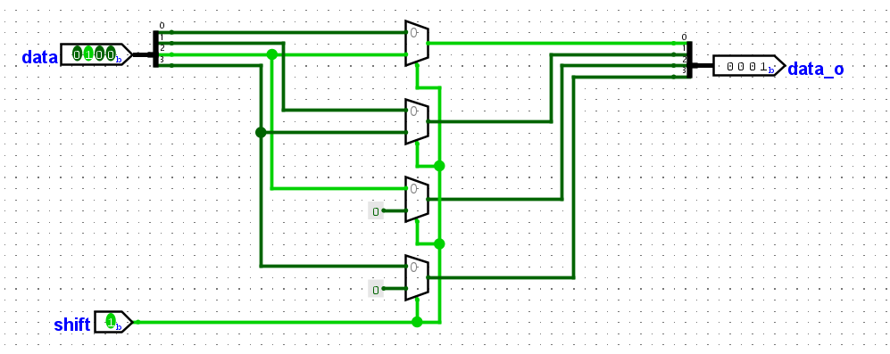

实验四 桶形移位器设计
==========================================

桶形移位器 (barrel shifter) 由组合逻辑电路构成，可以用于任意多位的位移操作。
你应该在编程语言中使用过左移、逻辑右移、算数右移等操作。

左移与右移
~~~~~~~~~~~~~~~~~~~~~~~~~~~~~~~~

逻辑右移与算数右移
--------------------------------

逻辑右移（Logical Right Shift）与算术右移（Arithmetic Right Shift）都是常见的位移运算，
用于将二进制数的各个位向右移动若干位，但它们在符号位的处理上不同。

逻辑右移时高位直接补 0 ，低位丢失，不需要考虑符号位。
以下图为示例，每行逻辑右移一位。

.. code-block::
   :caption: 8位二进制数逻辑右移示意图
   :linenos:

        11000010            01000010
    ->  01100001        ->  00100001
    ->  00110000        ->  00010000
    ->  00011000        ->  00001000
    ->  00001100        ->  00000100
    ->  00000110        ->  00000010
    ->  00000011        ->  00000001
    ->  00000001        ->  00000000
    ...                 ...

算数右移时高位补符号位，符号位为1则补1，符号位为0则补0，低位丢失，因此需要考虑符号位。
以下图为示例，每行算数右移一位。

.. code-block::
   :caption: 8位二进制数算数右移示意图
   :linenos:

        11000010            01000010
    ->  11100001        ->  00100001
    ->  11110000        ->  00010000
    ->  11111000        ->  00001000
    ->  11111100        ->  00000100
    ->  11111110        ->  00000010
    ->  11111111        ->  00000001
    ->  11111111        ->  00000000
    ...                 ...

从逻辑右移与算数右移示意图的第二列不难看出，当8位二进制数的最高位为0时，逻辑右移与算数右移没有区别。
但是最高位为1时，算数右移时高位补1。

**左移操作** 没有区分逻辑左移和算数左移，就是左移低位补0，高位丢失。

移位的应用
----------------------------------------

乘除法运算
^^^^^^^^^^^^^^^^^^^^^^^^^^^^^^

左移可以替代乘以2的幂次，右移可以替代除以2的幂次。
前提是数值的有效位没有消失，算数右移可以对补码表示的负数进行除以2的幂次。
你可以使用一门编程语言例如C/C++、Java对数进行左移、逻辑右移、算数右移，输出并观察结果。

循环移位
^^^^^^^^^^^^^^^^^^^^^^^^^

循环位移不会丢失高位或者低位，而是将移出的部分放在补充的位置。

.. code-block::
   :caption: 8位二进制数循环右移示意图
   :linenos:

        11000010            01000010
    ->  01100001        ->  00100001
    ->  10110000        ->  10010000
    ->  01011000        ->  01001000
    ->  00101100        ->  00100100
    ->  00010110        ->  00010010
    ->  00001011        ->  00001001
    ->  10000101        ->  10000100
    ...                 ...

尽管我们的桶形移位器不支持循环移位，但是我们可以通过两次逻辑移位和或运算实现循环移位。
例如可以通过 ``y = (x >> n) | (x << (32 - n));`` 实现32位二进制数循环右移程序。

桶形移位器电路
~~~~~~~~~~~~~~~~~~~~~~~~~~~~~~~~

桶形移位器可以移位任意位，例如一个16位的桶形移位器，可以移位 0~15 位，大于15位的移位操作没有什么实际的意义。
下面的电路实现了4位宽二进制数逻辑右移 0 或者 1 位的功能，最高位补零即可。使用了4个二选一选通器。

.. figure:: ../picture/lab4/4bit_srl1.png
   :alt: 4bit_srl1
   :align: center

电路实现很简单，当选择端输入为1时，选择高一位的信号，否则选择对应位的信号。

同样，当选择端输入为1时，选择高两位的信号，否则选择对应位的信号，即可实现逻辑右移 0 或者 2 位的功能。
那么如果需要逻辑右移 3 位，则将逻辑右移 2 位之后的信号给上面逻辑右移 1 位的电路即可完成功能。

多路选通器
----------------------------------------

二选一选通器
^^^^^^^^^^^^^^^^^^^^^^^^^

.. code-block:: v
   :caption: 二选一选通器代码示例
   :emphasize-lines: 15, 16
   :linenos:

    module mux2_1 #(
        parameter W = 8
    ) (
        ,a      
        ,b      
        ,sel    
        ,out    
    );

    input   a, b, sel;
    output  out;
    wire    [W-1:0] a, b, out;
    wire    sel;

    // assign out = sel ? b : a;
    assign out = ({W{sel}} & b) | ({W{~sel}} & a);

    endmodule

二选一选通器代码示例使用了两种常见的实现方式，第一种方式是行为级建模，使用 **三目运算符 ? : ** ，
在高级语言里面很常见，当 ``sel`` 为真时 out = b，否则 out = a 。

第二种方式是电路级建模， ``{W{sel}}`` 是 位拼接操作，将1位宽的sel信号复制W份拼接在一起。
比如 {32{1'b0}} 表示 32'b0 ， {4{8'h12}} 表示 32'h12121212 。

四选一选通器
^^^^^^^^^^^^^^^^^^^^^^^^^

四选一选通器可以通过3个二选一选通器组成。下面是代码示例。

.. code-block:: v
   :caption: 四选一选通器代码示例
   :emphasize-lines: 15, 16
   :linenos:

    module mux4_1 #(
        parameter W = 8
    ) (
        ,a      
        ,b      
        ,c      
        ,d      
        ,sel    
        ,out    
    );

    input   a, b, c, d, sel;
    output  out;
    wire    [W-1:0] a, b, c, d, out;
    wire    [1:0]   sel;

    // assign out = sel[1] ? (sel[0] ? d : c) : (sel[0] ? b : a);
    assign out = ({W{sel == 2'b00}} & a) | ({W{sel == 2'b01}} & b) | 
        ({W{sel == 2'b10}} & a) | ({W{sel == 2'b11}} & a);

    endmodule

多选一选通器
^^^^^^^^^^^^^^^^^^^^^^^^^

.. raw:: html

    

        
 慎用 always 语法 

        
我们其实已经初步掌握了一些 Verilog 语法，但其实示例代码中还没有与 always 相关的部分，因为 always 的
        使用比较复杂，我希望大家在掌握之前慎用，防止出现你难以理解的bugs。

    

always 可以用来实现组合逻辑电路，以后的实验还会使用 always 实现时序逻辑电路。

.. code-block:: v
   :caption: always代码片段示例
   :emphasize-lines: 1, 6, 8, 14, 16
   :linenos:

    // assign out = a & b;
    always @(a or b)    begin
        out = a & b;
    end

    // assign pop_cnt = in[0] + in[1] + in[2] + in[3] + in[4] + in[5] + in[6] + in[7];
    always @(*) begin
        pop_cnt = 0;
        for (integer i = 0; i < 8; i = i + 1)   begin
            pop_cnt = pop_cnt + in[i];
        end
    end

    // assign out = sel[1] ? (sel[0] ? in[31:24] : in[23:16]) : (sel[0] ? in[15:8] : in[7:0]);
    always @(*) begin
        out = 0;
        for (integer i = 0; i < 32; i = i + 8)  begin
            out = out | ({8{sel == (i/8)}} & in[i+7:i]);
        end
    end

always与assign区别很大，  @(a or b) 是指当敏感信号列表中的a或者b的值发生变化时，执行更新赋值操作。
因此当a或者b变化时， ``out = a & b`` 这样就与 ``assign out = a & b;`` 是一个意思。
但是当敏感信号列表中只有 a 而没有 b 时，只有 a 改变了才会使得 ``out = a & b`` ，而 b 改变之后不会使得
``out = a & b`` ，这样显然与  ``assign out = a & b;`` 或者与门电路的含义是不一样的。

always @(*) 表示敏感信号为所有输入信号，可以防止遗漏，发生上面那样的错误，偏离了与门电路的含义。
高亮的 ``pop_cnt = 0;`` 和 ``out = 0;`` 是不能遗漏的，否则他们没有初始值，会一直是 x 状态。
他们都与注释中使用 assign 写的电路含义是完全一致的，但是它们可以更好的参数化，不用修改代码就能调整参数。
最下面的例子给出了 四选一选通器 的实现方法。

.. raw:: html

   

      
八选一选通器

      
使用 assign 和 always 两种参考方法，实现八选一选通器，数据为8位宽，并
      通过 testbench 程序检验两种方法功能是否完全一致。

   

桶形移位器电路实现
~~~~~~~~~~~~~~~~~~~~~~~~~~~~~~~~

.. figure:: ../picture/lab4/barrel_shifter.png
   :alt: barrel_shifter
   :align: center

这里给出了8位桶形移位器电路实现方式，其中上面是左移电路，下面是右移电路，
右移高位补0或者符号位通过一位信号来选择是运算逻辑右移或者算数右移操作。
最后通过一个8位宽的二选一选通器选择是左移还是右移，完成了8位桶形移位器功能。

.. raw:: html

   

      
16位桶形移位器

      
使用前面的选通器，参考上图或者参考<a class="reference external" href="https://gitee.com/cocoa_gitee/course_-fcma201_25-fall">南京大学的课程实验</a>
      中的桶形移位器电路结构图，实现16位桶形移位器。有4位输入信号控制移位数，2位信号用来控制操作类型，
      2'b00表示左移，2'b01表示逻辑右移，2'b11表示算数右移。

   

.. raw:: html

   

      
 2'b10 的操作 

      
当控制操作类型的信号是 2'b10 时，上面使用logisim实现的8位桶形移位器电路是完成什么操作，为什么呢？

   

