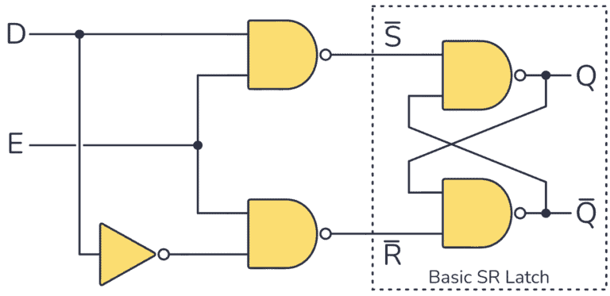
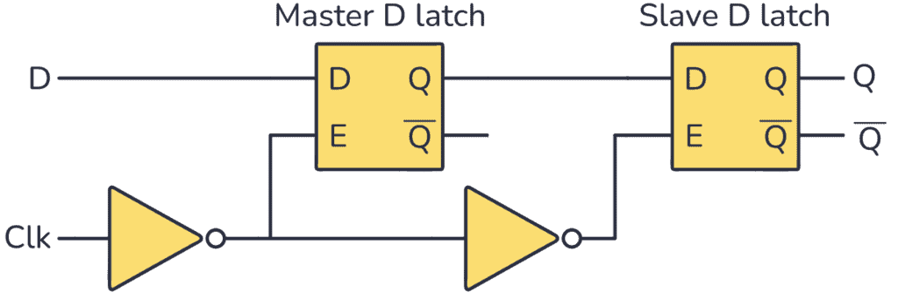

时序逻辑电路设计
====================================

在上一次实验中我们才开始使用 always 描述组合逻辑电路，不过使用 always 比较危险，可能与你想要实现的电路和功能不一样。
使用 always 描述组合逻辑电路时容易生成锁存器电路 (Latch) 。
因此我们想要使用 always 描述组合逻辑电路时需要小心谨慎，严格遵守规范。

always 描述组合逻辑电路时常见错误
~~~~~~~~~~~~~~~~~~~~~~~~~~~~~~~~~~~~~~~~~~~~~~

if 语句分支不完整
-------------------------------

.. code-block:: v
   :caption: if 语句分支不完整示例
   :emphasize-lines: 5-6
   :linenos:

    reg q;

    always @(*) begin
        if (en)
            q = d;     // 当 en = 1 时给 q 赋值
        // 当 en = 0 时，q 没有任何赋值语句
    end

当 en = 1 时 q = d，而当 en = 0 时，并没有说明 q 应该赋什么值，因此保持原值。
要“保持原值”就必须使用存储单元，推断出电路需要一个 **电平使能的锁存器** 。

因此在描述组合逻辑电路时必须将 if-else 补充完整。

if-else 存在分支没给所有信号赋值
----------------------------------------------

.. code-block:: v
   :caption: if-else 存在分支没给所有信号赋值示例
   :emphasize-lines: 7-10
   :linenos:

    reg a, b;

    always @(*) begin
        if (en) begin
            a = d;    
            b = c;
        end else begin
            a = 0;  // 只给 a 赋值
            // b 没赋值
        end
    end

当 en = 0 时，并没有说明 b 应该赋什么值，因此保持原值。
要“保持原值”就必须使用存储单元，推断出电路需要一个 **电平使能的锁存器** 。

因此需要每个分支都要完整的描述每个信号的赋值。如果情况比较复杂，最好每个信号单独在一个 always 块
中被赋值，防止出错。

如果将上面的代码修改为下面这样写，就不会生成锁存器，描述完整了所有信号在每个分支的情况。

.. code-block:: v
   :caption: if-else 存在默认赋值示例
   :emphasize-lines: 4
   :linenos:

    reg a, b;

    always @(*) begin
        b = 0;
        if (en) begin
            a = d; 
            b = c; 
        end else begin
            a = 0; 
        end
    end

这样 b 信号默认赋值为 0，不存在有分支没有分支没有被赋值的情况，不会生成锁存器电路。

if-else / case 没覆盖所有分支情况
------------------------------------

.. code-block:: v
   :caption: if-else 没覆盖所有分支情况
   :emphasize-lines: 8
   :linenos:

    reg q;

    always @(*) begin
        if (a & b)
            q = 1'b1;
        else if (c)
            q = 1'b0;
        // 其他情况，比如 a = 1, b = 0, c = 0, q 没有被赋值
    end

只要存在某些输入组合时，q 没有被赋新值，那么 q 就会“保持原值”，生成锁存器电路。

.. code-block:: v
   :caption: case 没覆盖所有分支情况
   :emphasize-lines: 8
   :linenos:

    reg y;

    always @(*) begin
        case (sel)
            2'b00: y = a;
            2'b01: y = b;
            2'b10: y = c;
            // 2'b11 没有 default 处理
        endcase
    end

正确使用如下，对于其他的分支可以赋值默认值

.. code-block:: v
   :caption: default 覆盖其他的分支
   :emphasize-lines: 8
   :linenos:

    reg y;

    always @(*) begin
        case (sel)
            2'b00: y = a;
            2'b01: y = b;
            2'b10: y = c;
            default : y = 0;
        endcase
    end

同样，如果有 default ，但有分支没给所有目标信号赋值：

.. code-block:: v
   :caption: default 覆盖其他的分支
   :emphasize-lines: 8
   :linenos:

    reg x, y;

    always @(*) begin
        case (sel)
            2'b00: begin
                x = 0;
                // y 没赋值
            end
            2'b01: begin
                x = 1;
                y = 1;
            end
            default: begin
                x = 0;
                y = 0;
            end
        endcase
    end

在没有赋值的情况下， y 保持原值，生成锁存器电路。

上面举了一些常见的例子说明描述组合逻辑电路时常见的生成了锁存器电路的错误，在使用casex/casez时也要特别注意，
很容易生成锁存器电路，因此不推荐使用。

D锁存器和D触发器
~~~~~~~~~~~~~~~~~~~~~~~~~

存储单元种类有很多，功能和用途都不太一样，在之后的课程中我们会接触到更丰富的存储单元，
我们本次实验只介绍锁存器和寄存器电路。

D锁存器 (D-Latch)
----------------------

这是常见的D锁存器电路结构，当 E 为 1 时，Q = D，当 E 为 0 时，Q锁存信号。
它基于 S-R 锁存器，但没有“无效”状态问题。输入端的反相器确保 S 和 R 输入始终相反，以避免两者都为 1 的无效状态。

D触发器 (D Flip Flop)
---------------------------------

D触发器由两个D锁存器构成，如下图电路结构所示：

由于D锁存器在 E 为高电平时 Q = D，否则锁存信号，因此主锁存器在高电平锁存信号，从锁存器在低电平锁存信号，
整个电路只在使能信号上升沿时保存信号。

为什么不推荐你使用锁存器
--------------------------------

在实际的数字电路芯片中，会使用锁存器电路，但通常是比较高级的用法，对于初学者，应该尽量避免使用锁存器。

锁存器容易导致时序难以分析
^^^^^^^^^^^^^^^^^^^^^^^^^^^^^^^^^^^^^^

锁存器是电平触发的，对电平敏感，在使能期间输入信号的任何抖动都会实时传到输出。
这增加时序分析难度，并容易引入竞争冒险。

相比之下，触发器（Flip-Flop）是边沿触发的，仅在时钟边沿采样一次，更容易保证稳定性。

锁存器会破坏同步时序体系
^^^^^^^^^^^^^^^^^^^^^^^^^^^^^^^^^^^

现代数字电路系统（ASIC / FPGA ）采用严格的同步时序设计，使用全局主时钟，所有信号只在时钟边沿采样。
锁存器的电平触发会显著增加时钟设计难度。

锁存器在 FPGA 中实现代价更高
^^^^^^^^^^^^^^^^^^^^^^^^^^^^^^^^^^^

在我们的 FPGA 中提供了大量的触发器 (Flip-Flop)，但不直接提供锁存器电路，因此锁存器电路通常使用 LUT + 触发器实现，
因此实现锁存器会消耗更多的资源。

什么时候会使用锁存器
^^^^^^^^^^^^^^^^^^^^^^^^^^^^^^^^

可以在定时电路中引入延迟、作为缓冲区，或在特定间隔采集数据。

在高速电路中，可以通过锁存器的透明窗口，慢路径可以“借用”下一段的时间，提高总体时钟频率。

在低功耗设计中，锁存器由于比触发器的晶体管数量更少，面积更小，功耗更低。

所以，需要使用锁存器的情况比较进阶，作为初学者，不推荐你使用锁存器。

简单时序逻辑电路设计
~~~~~~~~~~~~~~~~~~~~~~~~~~~~~~~~~

计数器电路
-----------------------

在数字系统中，我们经常使用计数器来记录系统的状态。比如我们的系统时钟为10Mhz，想要获得一个1Hz的时钟，我们可以从
0计数到4999999，共0.5s，然后翻转信号来获得1Hz的时钟。

